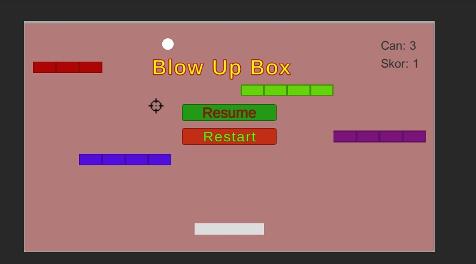
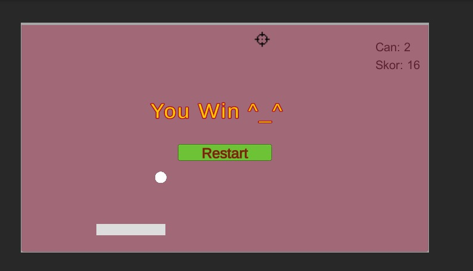
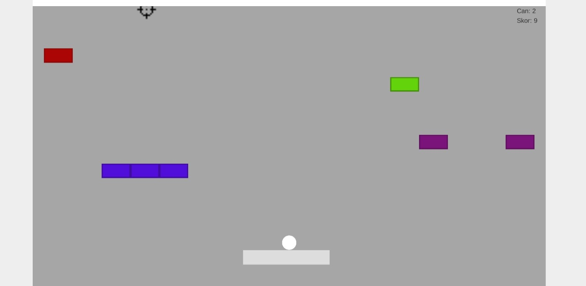

# 3. Sınıf Güz Dönemi Oyun Programlama Projem: BlowUpBox

<h3 align="center" color="Darkblue">Çağla Yağmur İçer</h3>
<h4 align="center" color="Darkblue">ogrenciNo</h4>
<h6 align="center" ><a href="https://bahadir-aksakal.itch.io/blowupboxx" color="Purple">Oyunu Oynamak İçin Tıklayın(https://bahadir-aksakal.itch.io/blowupboxx)</a></h6>

<ol>
  <li>
      <h3 color="Red">Projede Kullanılan Teknoloji Ve Diller:</h3>
      <ul>
        <li>Unity - C#</li>
      </ul>
  </li>
  <li>
      <h3 color="Red">Nasıl Oynanır:</h3>
      <ul>
        <li>Oyunun amacı, topu tüm karelere çarptırarak onları yok etmektir.</li>
        <li>Top zemine değerse 1 canınız gider. Toplam 3 canınız bulunmaktadır. Can 0 olduğunda oyunu kaybedersiniz ve oyun baştan başlar.</li>
        <li>Sağ ve Sol yön tuşları ile playeri hareket ettirin. Sol mouse-click ile ateş edin.</li>
        <li>16 bloğu kırdığınızda oyunu kazanırsınız.</li>
      </ul>
  </li>
  <li>
      <h3 color="Red">Yapımcılar:</h3>
      <ul>
         <li>Ahmet Bahadır Aksakal - Çağla Yağmur İçer</li>
         <li>Oyun için remote çalışmak pek sağlıklı olmayacağından, oyyun geliştirme sürecinde ekip arkadaşımla birlikte tek bir bilgisayar üzerinden çalıştık</li>
         <li>Projedeki tüm scriptleri ve tasarımları birlikte yaptık.</li>
         <li>İllaki bir örnek vermek gerekirse: Bahadır Aksakal; oyun pause kısmı, zamanın durması, pause menüsü, getAxis yapısı üzerinden biraz daha fazla   uğraşmıştır. Çağla Yağmur; top fiziği, nişangah, collision, box'lar ve rigidBody'ler üzerinde biraz daha fazla uğraşmıştır.  </li>         
    </ul>
  </li>
  <li>
      <h3 color="Red">Görseller:</h3>
      <ul>
        <li></li>
        <li></li>
        <li></li>
      </ul>
  </li>
</ol>

